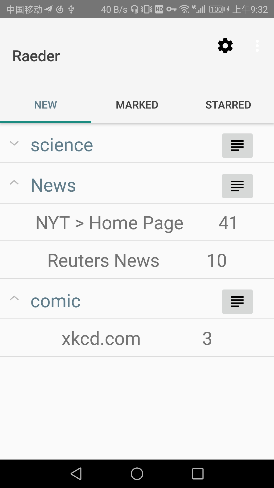

# Raedar 文档

[TOC]

## 简介

Raedar是一个轻量级的安卓端*[RSS](https://baike.baidu.com/item/rss/24470?fr=aladdin)*阅读软件，旨在给用户提供一个能自定义和管理消息来源的阅读体验。*RSS*(Really Simple Syndication)是一种基于*XML*的被各大网站广泛采用的内容包装和投递协议，提供了一种简单的描述和同步网站内容的方法。

目前市场上所有的绝大多数是微博、头条、知乎等结合用户自己的关注和根据算法自动推荐的内容的应用，将这些应用作为消息来源的弊端在于算法推荐的是*你可能会点*的内容，却不是*对你有益*的内容，而且算法倾向于推荐点击量大、热门的内容，这也不利于我们获取优质的内容深的信息。最近Facebook的用户信息泄露事件也向我们敲响了警钟，如果我们任由只追逐利益的互联网公司左右我们每天看到的新闻的话，最后结果将是可怕的。

Raedar中用户可以自定义订阅的RSS源，并且收藏与标记其认为有用的内容。这有利于用户选择性地只浏览自己添加的高质量的文章，而不会被广告或者算法推荐的内容分心，更高效地获取自己想要的信息，缺点是用户需要自己寻找高质量可靠的RSS源，目前大部分网站均提供RSS订阅方式，因此这不应该是一个问题。

## 功能介绍

本软件主要由以下几个界面组成：

- 主界面

  可以选择要查看信息的源、组，刷新源，进入管理源的界面

- 文章列表界面

  可以浏览特定源或源组里的消息

- 文章简介页面

  查看文章的简介，跳转到浏览器浏览文章，收藏文章

- 源管理页面

  添加、删除源及进行备份

## 技术相关

本软件使用Android Studio 3.0开发完成，开发语言为Kotlin，在开发中使用到的第三方库包括且不限于：

- Room

  用于管理本地的数据库

- Fuel

  用于网络请求、获取内容

- RxJava

  用于多线程相关的逻辑管理

## 前端代码

### MainActivity.kt

这是用户打开app时首先进入的`Activity`，也是软件的主界面和总入口。主界面总体是一个`TabView`，由三个基本相同的`Fragment`组成，其实现在`feedList`包当中，由于这三个`Fragment`除了需要显示的数据之外完全相同，因此这里定义了一个`abstract class` 作为基类，令这三个`Fragment`继承它并实现`getData`方法即可，这样减少了代码重复量的同时也更加便于维护。

### SourceActivity.kt

这是管理用户自定义的源的`Activity`，这个界面主要是一个`RecycleView`组成，其中每个子`View`的删除事件由回调在主`Activity`当中实现。为了防止误操作，在点击Delete之后还需要再跳出的`AlerrtDialog`中点击确认才能进行删除。

### AddSourceActivity.kt

一个简单的的用于添加源的`Activity`，输入框为`EditText`和`AutoCompleteView`，可以自动提示已经有的Category。利用`TextWatcher`实现了监听输入框内容改变的事件，实现了只有两个输入框皆不为空时才能点击完成的功能。

### FeedList.kt

该`Activity`主要由一个`RecycleView`组成，用于展示某一个特定的源/源组当中包含的feed，该`Activity`会检测当前设备的屏幕大小，如果是平板设备的话则会切换到two-pane视图，在屏幕左边展示feed的列表，右边展示选中的feed的详细内容。否则则只选择列表，详细信息的展示则让`FeedDetailActivity`来实现。为了实现这个功能，我们将详细内容的展示放到`FeedDetaioFragment`当中，以减少重复代码。

### FeedDetailActivity.kt

用于展示feed的详细内容，为了显示description的html内容使用了WebView，点击标题可以跳转到该feed对应的网址。

## 后端代码

### database

该包中主要包含了使用`Room`与数据库进行交互的代码，在使用`Room`的过程中主要是使用其DSL来定义各个行为的逻辑，然后在编译时自动生成详细的代码。这里也定义了`Feed`与`Source`数据类型。

### backup

该包中主要包含与备份相关的代码，目前只有将需要备份的数据转换为*JSON*字符串返回与解析备份的*JSON*字符串的方法。

### network

该包中包含网络交互的代码，从网上获取源的信息，对获取到的RSS进行解析并返回一个`RSS`对象，对该对象包含所有需要的信息且可以直接进行操作。

## 技术难点

- 在进行数据库和网络I/O操作时为了避免其延迟阻塞主线程，造成UI延迟、无反应，需要在子线程当中操作并异步处理结果，使用自带的`AsyncTask`常常会让代码变得不必要得复杂、难以维护，尤其在一个操作当中涉及多个相互依赖的I/O操作时更是如此。本项目采用*RxJava*来处理类似的情况（比如添加源的操作就涉及了首先发出网络请求检查是否是一个有效的RSS源，然后再将其添加到数据库当中），使代码的逻辑更加简单易懂，避免了不必要的复杂度。
- RSS是建立在XML格式之上的，而要获取文章列表则必须有效地解析网站返回的XML文件，安卓本身库中提供的`XMLParser`比较原始，不能直接使用，网上也没有可以直接利用的第三方库。为了解析文章列表，本项目使用自带的`XMLParser`写了解析RSS格式的代码并包装为`RSSParser`对象，解决了这个问题。
- 安卓本身的操作数据库的库操作起来较为麻烦且容易出错，而且如果有在版本更新之后数据库的模式需要更新等需求的时候将更加麻烦，因此我们使用谷歌官方推荐的`Room`库来管理数据库，使用`Room`的优点主要有以下几点：
  - Room本身有RxJava的拓展，可以直接返回`Maybe` 、`Flowable`等方法，且基于`Livedata`，对`Activity`是Lifecycle-aware的，避免了内存泄露与后台占用资源的问题。
  - 在多个数据库中涉及`Foreign Key`、`Trigger`等操作时，用传统的数据库将会很麻烦，而Room则几乎不用做配置，会自己解决许多问题，这给我们带来了很大的便利。
  - 便于分隔开数据库代码与主逻辑代码，使软件的框架更明确。
- 网络请求与其结果的处理需要异步进行，这个问题已经由`RxJava`的使用得到了解决，因此便不再赘述。
- 当数据变动的时候软件显示的内容也要随之变化，展示最新的形态，这个功能的实现如果处理不当的话可能会比较繁琐，增加许多容易出错的代码。这里我们利用了Room拓展库中`Flowable`的行为，Room的方法返回`Flowable`时行为是这样的：在第一次调用和每次数据改变的时候都会调用其`onNext`方法。因此我们只要确保每次都调用一次数据库方法来更新UI即可做到UI显示的与数据库同步的效果。
- 因为本软件的特点，需要经常在各个`Activity`与`Fragment`之间切换和传递数据，如果这里处理不好的话会很严重地影响各界面切换的效率与用户体验。在这里我们直接将`List<Feed>`与`Feed`作为数据传入传出，这要求`Feed`实现`Parcelable`的功能，在这里我们利用了Kotlin提供的很方便的插件，直接在`data class`之前加`@Parcelize`即可自动生成代码实现`Parcelable`，本软件很多其它地方也利用了Kotlin的特性与其在安卓上特有的插件，使代码比普通的Java代码更加易懂、简洁。
- 备份功能的实现是一个很大的挑战，因为用户定义的源的名字及URL皆可以包含特殊字符，编码方式也有很多可能性，所以如果直接使用操作字符串的方式来做备份的话可能会遇到许多意想不到的情况，在这里我们使用了**JSON**的格式来保存数据并使用了Java提供的`org.json`库，避免了手动去处理很多*edge case*，这样做还有一个好处就是再以后需要添加更多功能的时候可以很方便地拓展备份的设置，而且向后兼容性也得到了保证。由于在安卓文件的操作对于用户来说并不方便，因此本软件采用了直接在*剪贴板*上导入导出备份字符串的方式管理备份，用户可以自己选择在*任何*一个地方保存备份的字符串。

## 还需改进的地方

- 目前UI的设计缺陷很大，主要是因为安卓的Layout方面涉及的属性很多，知识比较杂，且没有什么技术含量，故因为时间的原因没有做太多的改进。目前的界面十分原始，离一个让人可以正常舒服地使用的app还差得很远。
- 目前源在添加之后没有办法方便地改变其所属的Category、URL等信息，只能重新添加将其覆盖，这个功能也许会有用，所以还可以再做改进。
- 添加*Atom*格式支持。

## 实际效果截图

### 主界面

### 管理源界面

### Feed详细界面

### Feed列表界面

## 更多

本项目使用git管理，在Github上开源，代码地址在[这里](https://github.com/ouromoros/Raedar.git)。